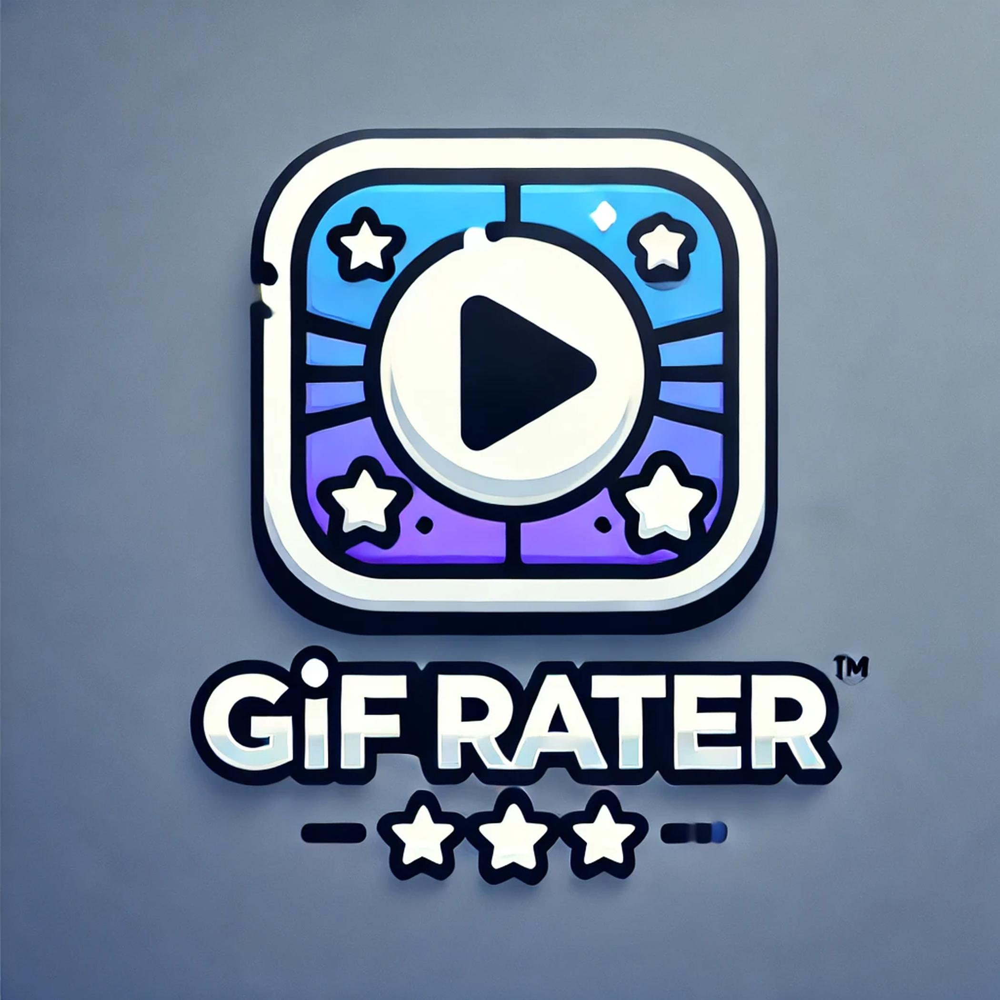
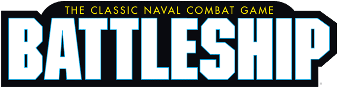
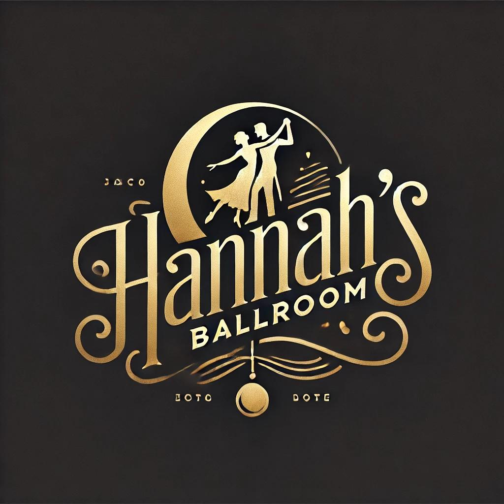

# Eduardo Velez Portfolio

This is the portfolio website for Eduardo Mauricio Velez Murillo, showcasing projects, resume, and contact details. The website features a modern design with responsive layouts, utilizing **React**, **Chakra UI**, and **React Router** for smooth navigation and great user experience.

## Table of Contents

- [About](#about)
- [Features](#features)
- [Project Setup](#project-setup)
- [Running the Project](#running-the-project)
- [Technologies Used](#technologies-used)
- [Portfolio Projects](#portfolio-projects)
- [Contact Information](#contact-information)

## About

This portfolio showcases my skills as a developer, including the projects I've worked on, my resume, and a way to contact me. It also includes a link to my towing company, **EV Towing PNW**.

## Features

- **Responsive Design:** The portfolio is fully responsive and works on all screen sizes.
- **Project Gallery:** Display of my projects with links to the GitHub repositories.
- **Resume Preview and Download:** You can preview my resume directly on the page and download it as a PDF.
- **Easy Navigation:** Navigate through different sections like About Me, Portfolio, Resume, and Contact with ease.
- **Towing Company:** A link to my towing company, **EV Towing PNW**, in the header.
  
## Project Setup

### Prerequisites

- **Node.js**: Ensure that Node.js is installed. You can download it from [here](https://nodejs.org/).
- **npm or yarn**: Package manager to install the dependencies. It comes with Node.js.

### Installation

1. Clone the repository:
   ```bash
   git clone https://github.com/Massogon/your-portfolio-repo.git
   ```

2. Navigate to the project directory:
   ```bash
   cd your-portfolio-repo
   ```

3. Install dependencies:
   ```bash
   npm install
   ```

## Running the Project

1. Start the development server:
   ```bash
   npm run dev
   ```

2. Open your browser and go to:
   ```bash
   http://localhost:3000
   ```

The website should now be up and running locally.

## Technologies Used

- **React**: A JavaScript library for building user interfaces.
- **Chakra UI**: A simple, modular, and accessible component library for React.
- **React Router**: For managing navigation between different pages of the website.
- **Vite**: A fast build tool and development server.

## Portfolio Projects

Here are some of the projects that are featured in this portfolio:

1. **Gif Rater**
   - **Link**: [GitHub Repository](https://github.com/Massogon/gif-rater)
   - A tool to rate and organize GIFs.
   - **Image**: 

2. **Goat Battleship**
   - **Link**: [GitHub Repository](https://github.com/Massogon/goat-battleship)
   - A multiplayer battleship game.
   - **Image**: 

3. **Hannah Smith Ballroom**
   - **Link**: [GitHub Repository](https://github.com/Massogon/hannah-smith-ballroom)
   - A ballroom dance studio website.
   - **Image**: 

## Contact Information

You can reach me at:

- **Email**: [eduardovelez11759@gmail.com](mailto:eduardovelez11759@gmail.com)
- **Phone**: +1 503-960-2857
- **GitHub**: [Massogon](https://github.com/Massogon)
- **YouTube**: [Massogon YouTube](https://www.youtube.com/@massogon)
  
You can also check out my towing company:
- **EV Towing PNW**: [https://www.evtowingpnw.com/](https://www.evtowingpnw.com/)

---

Feel free to explore the code, and contact me if you have any questions or opportunities for collaboration!
